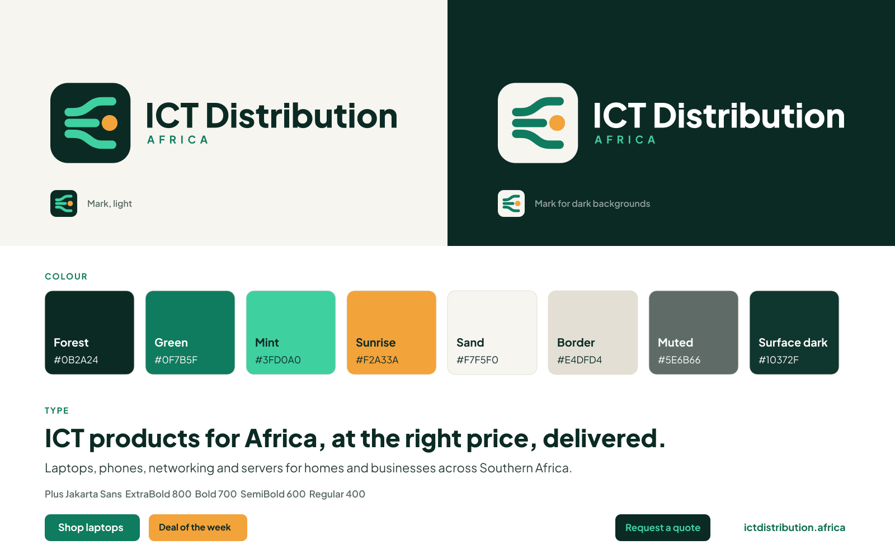

# ICT Distribution Africa: Brand Guidelines

Version 1.0, October 2026. Production files and UI tokens for ictdistribution.africa.

Tagline: ICT products for Africa, at the right price, delivered.

## Instruction for Claude Code

This folder is the source of truth for the brand. Copy it into the repo as `brand/` and follow this file exactly. Use the files as they are. Do not redraw the logo, recolour it, or set the wordmark in live text; the wordmark in every SVG is already outlined. Take every colour, radius and spacing value from `tokens/tokens.css` (or `tokens/tokens.json`), never from memory or a screenshot. Never show supplier or manufacturer names as part of the brand (see Logo rules).

## Logo

The mark is a Forest rounded-square tile. On it, three Mint lanes leave the left edge as one parallel bundle; the outer two curve away to the top and bottom while the middle one runs straight on and ends at a single Sunrise dot. It reads as stock leaving one source and fanning out across a region, with the dot as the delivery point. The wordmark sets "ICT Distribution" in Plus Jakarta Sans ExtraBold with "AFRICA" in Plus Jakarta Sans Bold, small and wide-tracked, left-aligned beneath it.

| File | Use |
| --- | --- |
| `logo/ictd-logo.svg` | Primary lockup on white, Sand and other light backgrounds |
| `logo/ictd-logo-reverse.svg` | Reverse lockup on Forest and dark backgrounds (Sand tile, white wordmark, Mint "AFRICA") |
| `logo/ictd-mark.svg` | Standalone mark: favicons, app icons, avatars, small spaces |
| `logo/ictd-mark-light.svg` | Mark on Forest or dark backgrounds, where the Forest tile would disappear (Sand tile, Green lanes) |
| `png/` | PNG versions: lockups at 640, 1280 and 2560 px wide, marks at 256, 512 and 1024 px |
| `icons/web/` | `favicon.ico` (16, 32, 48; the 16 px frame is pixel-hinted), `favicon.svg`, `apple-touch-icon.png` (180, opaque), `icon-192.png`, `icon-512.png`, `icon-maskable-512.png` (mark inside the 80% safe zone on Forest) |
| `icons/ios/AppIcon-1024.png` | App Store icon, opaque, square corners (iOS rounds them) |
| `icons/android/` | `ic_launcher-512.png` (Play listing) and `ic_launcher_foreground-432.png` (adaptive foreground, transparent, inside the 66 dp safe zone). Adaptive background colour: #0B2A24 |
| `brand-preview.png` | One-page overview for reviews and handover. Not for production use |

Rules:

- Clear space: keep free space around the lockup and the mark equal to half the tile height on every side. At the master size (tile 144 units) that is 72 units.
- Minimum sizes: full lockup 200 px wide on screen (about 46 px tall) and 45 mm in print. Below that, use the mark alone. Mark: 16 px on screen (use `favicon.ico`, which has a hinted 16 px frame), 8 mm in print.
- Site header: use the lockup on desktop and tablet widths, and the mark alone on phone widths (below 640 px). The mark links home and carries the accessible name "ICT Distribution Africa".
- On light backgrounds use `ictd-logo.svg` and `ictd-mark.svg`. On Forest or dark backgrounds use `ictd-logo-reverse.svg` and `ictd-mark-light.svg`.
- The Sunrise dot is the only Sunrise element in the logo. Do not add a second one or recolour it.
- Do not stretch, rotate, recolour, outline, add shadows or effects, rearrange the lockup, or place it on busy photography.
- Supplier names are never shown in customer-facing brand use. Do not put supplier or manufacturer names or logos next to, inside or in place of our logo, in the header, on packaging, on email templates or on social avatars. Products may be named on their own product pages and in specs; the brand itself never carries a supplier name.

## Colour

Brand palette:

| Name | Hex | Role |
| --- | --- | --- |
| Forest | #0B2A24 | Primary. Carries the brand. Text on light; background in dark mode |
| Green | #0F7B5F | Primary buttons on light with a white label (5.2:1) |
| Green text | #0B6E54 | Link and accent text on light (6.2:1); primary button hover |
| Mint | #3FD0A0 | Accent. On dark: links, focus rings, primary button fill with Forest label (7.8:1). Lanes in the mark |
| Sunrise | #F2A33A | Specials, deals and highlights. As a fill with Forest text (7.35:1). The dot in the mark |
| Sunrise text | #B4590F | Amber text on white (4.8:1) |
| Sand | #F7F5F0 | Light surfaces, cards, page bands |
| Border | #E4DFD4 | Borders and dividers on light |
| Muted | #5E6B66 | Secondary text on light (5.6:1 on white, 5.1:1 on Sand) |
| Ink on dark | #C9D8D2 | Body text on Forest; headings on Forest are white |

Dark theme: background #0B2A24, surface #10372F, raised surface #133D34, border #1E4A40, headings #FFFFFF, body #C9D8D2, muted #8FA59D, primary fill #3FD0A0 with label #0B2A24, link text #3FD0A0.

Status colours. These are for system states only (stock, order status, form errors, notices), not brand colours. Each passes 4.5:1 as text on its theme's background, surface and raised surface:

| Status | Light | Dark |
| --- | --- | --- |
| Success | #14724A | #5BDB9F |
| Warning | #9A5300 | #F5B54A |
| Danger | #C0333A | #FF8A84 |
| Info | #1F5FA8 | #7DB9FF |

Accessibility rules for screens (WCAG AA, 4.5:1 for normal text):

- Mint on white is 2.0:1 and Sunrise on white is 2.1:1. Never use Mint or Sunrise for text, thin icons or button labels on light backgrounds. Both work as text on Forest (7.8:1 and 7.35:1).
- Green #0F7B5F is for button fills with white labels. For link text on light use #0B6E54.
- Amber text #B4590F passes on white (4.8:1) but not on Sand (4.4:1). On Sand, use it only for text 18.66 px bold or 24 px regular and larger, or put the text in a Sunrise pill with Forest text instead.
- Deals and specials use a Sunrise fill with Forest text. Never white text on Sunrise.
- Dark muted text #8FA59D is for the background and surface (5.9:1 and 5.0:1); on the raised surface it is 4.6:1, so do not go lighter than #133D34 behind it.
- Focus rings: Green #0F7B5F on light, Mint #3FD0A0 on dark, 2 px with a 2 px offset.
- Do not signal status with colour alone; pair it with an icon or a word.

UI tokens are in `tokens/tokens.json` and `tokens/tokens.css` (light and dark themes). In CSS, dark applies under `@media (prefers-color-scheme: dark)` unless `data-theme="light"` is set on `<html>`, and always when `data-theme="dark"` is set.

## Typography

Plus Jakarta Sans, free under the SIL Open Font License (files and licence in `fonts/`). In Next.js, load it with `next/font/google` (weights 400, 600, 700, 800) rather than serving the files. Otherwise self-host `fonts/PlusJakartaSans-Variable.woff2` (weights 200 to 800) and `fonts/PlusJakartaSans-Variable-Italic.woff2`; the static `Regular`, `SemiBold`, `Bold` and `ExtraBold` woff2 files are latin subsets for email and tools that cannot use a variable font.

- Display and page headlines: ExtraBold 800, letter spacing -0.02em, line height 1.15
- Section headings and product names: Bold 700
- Subheads, buttons and labels: SemiBold 600
- Body: Regular 400, 16 px on screen (never below 14 px), line height 1.55; 10 to 11 pt in print
- Prices: Bold 700 with tabular figures (`font-variant-numeric: tabular-nums`)
- Kickers: SemiBold 600, uppercase, letter spacing 0.12em. Use sparingly. The 0.4em tracking in the logo is for the logo only

Fallback: system-ui, then Segoe UI, Roboto, Arial.

## Voice

Plain, confident and helpful. Short sentences. We say what the product is, what it costs and when it arrives. We sell to individuals and to businesses, so we write for both: clear enough for a first-time buyer, exact enough for an IT manager.

- No exclamation marks.
- No em dashes. Avoid en dashes in prose too; write "to" for ranges ("3 to 5 days").
- No hype words ("amazing", "unbeatable", "revolutionary"). Let the price and the spec do the work.
- Give facts: stock, price including VAT, delivery time, warranty.
- Name the country or city when it matters to delivery.
- Supplier names are never part of brand copy, headlines, banners or ads.

Examples:

- "Laptops for work and study. In stock, delivered in 3 to 5 days."
- "Business pricing on bulk orders. Ask for a quote."
- "This week's deal: 15% off selected routers."

Tagline: ICT products for Africa, at the right price, delivered.
